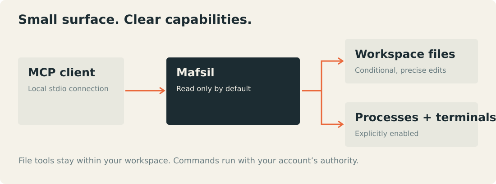

# Architecture and design decisions

Mafsil is a local MCP server built around nine composable primitives. The configured workspace and capability flags belong to the operator. Agents cannot widen them through tool arguments or MCP roots.

## Protocol and lifecycle

The official Go MCP SDK handles framing, schema validation, version negotiation, cancellation and modern request metadata. Mafsil adds bounded admission ahead of dispatch and caps tool concurrency. JSON-RPC frame limits apply before the SDK accumulates a complete request. No request/response bodies are logged.

Stdio is the sole built-in transport. One client process owns one server process; sessions are scoped to that server. Stdio supplies a local launch boundary without inventing a network authentication service. Remote reachability uses a separately operated adapter, such as the official Secure MCP Tunnel client. The project does not expose an unauthenticated HTTP listener.

## Package boundaries

| Package | Responsibility |
| --- | --- |
| `cmd/mafsil` | CLI, configuration selection, signals and stdio lifetime |
| `internal/config` | Operator settings and bounded validation |
| `internal/server` | MCP tools, annotations, native content and admission limits |
| `internal/workspace` | Rooted file access, conditional mutation, metadata and rollback |
| `internal/process` | Session limits, buffers, timeouts and native process ownership |
| `internal/terminal` | Bounded plain-text VT approximation, with no external effects |

Shared code defines behavior. Small OS-specific files implement file metadata, process creation and terminal handles. Windows uses suspended process creation followed by mandatory Job assignment. Linux uses process groups and a controlling PTY where requested. The differences are visible in the threat model, not hidden behind a stronger shared claim.

## File transactions

Paths are portable relative names. `os.Root` makes every filesystem operation traversal-resistant at the OS boundary. Mutation parents stay pinned through preparation, commit and recovery. There is no fallback to lexical-only containment.

Existing targets are read under byte limits, checked for regular-file type and hard links, and compared to a supplied SHA-256 revision. Exact replacements keep all unrelated bytes, including line endings. Candidate inodes are prepared and synced before commit. Original inodes are retained through same-directory hard links, preserving metadata for rollback. New-file publication cannot clobber an existing destination. Existing files are replaced rather than truncated.

The structured `edit_files` API was chosen over a custom textual patch language. It exposes expected revisions, explicit match counts and final path ownership directly in the schema. One batch cannot target the same path twice. Directory creation is a separate, single-directory primitive, keeping file rollback comprehensible.

There is one cancellation boundary before publication. Once commit begins, the transaction completes or attempts rollback on IO error. Cancellation remains meaningful to the transport, but does not imply rollback of completed side effects. Power loss and hostile concurrent writers require recovery, not an atomicity claim.

## Execution and terminals

Execution is disabled by default. Turning it on grants the server user's command authority; an allowlisted environment reduces accidental credential inheritance but cannot confine a command. Dedicated scratch directories keep normal child application caches separate and are removed at session completion.

Pipe readers drain before completion is reported. Ring buffers retain a bounded suffix with monotonic byte offsets, so polling never reruns commands and callers can distinguish replay from lost history. Active and retained session counts are bounded separately. Stdin writes serialize with cancellation and a timeout.

The terminal screen is deliberately an approximation. Raw VT remains available; the model handles common screen operations without implementing a browser, clipboard, hyperlink or graphics subsystem. Full grapheme-cell layout and terminal query replies are outside its contract.

## Distribution

Release candidates are built from source with pinned dependencies, `-trimpath`, explicit version/commit metadata and disabled VCS path embedding. Windows resources are generated only in staging. Source control contains editable brand assets, not application binaries.

Raw binaries avoid archive-extraction attack surfaces. Terminal installers verify checksums and ownership, retain originals during replacement and preserve unrelated operator data. Client-managed stdio does not need startup services; automatic service creation would widen installation permissions without helping the default lifecycle.

The optional tunnel is external to keep provider authentication, credential storage and control-plane dependencies out of the core binary. This trades one extra managed component for an independent upgrade path and a smaller trust boundary.

## Primary technical sources

- [MCP transport bindings and version compatibility](https://modelcontextprotocol.io/specification/2026-07-28/basic/transports)
- [Official Go MCP SDK v1.8.0](https://github.com/modelcontextprotocol/go-sdk/releases/tag/v1.8.0)
- [Go traversal-resistant file APIs](https://go.dev/blog/osroot)
- [Windows Job Objects](https://learn.microsoft.com/en-us/windows/win32/procthread/job-objects)
- [Windows pseudoconsole lifecycle](https://learn.microsoft.com/en-us/windows/console/creating-a-pseudoconsole-session)
